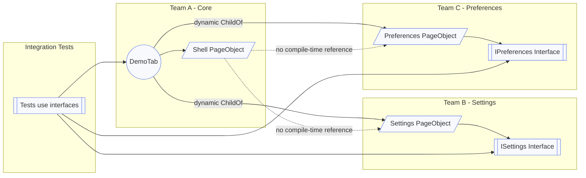

# Trumpf.Coparoo.Playwright Demo

This demo project showcases the powerful capabilities of the **Trumpf.Coparoo.Playwright** framework through a practical example that demonstrates real-world patterns for building maintainable, modular web test automation.

## Demo in Action


This demo exercises dynamic page object relationships, interface-only test access, and convention-based navigation between Settings and Preferences pages.

## Clean Test Code Example

Here's what a typical test looks like with Coparoo.Playwright - notice the clean, readable code with **no delays, no waits, no brittle selectors**. The example uses [Awesome Assertions](https://github.com/awesome-inc/awesome-assertions) for expressive assertion checking:

```csharp
[TestMethod]
public async Task NavigateBetweenPages()
{
    // Arrange: Create browser instance
    var browser = new DemoTab(headless: true);
    try
    {
        await browser.Open();

        // Get reference to Settings page - type-safe, no strings!
        var settings = browser.On<ISettings>();

        // Interact with checkboxes - clean, expressive API
        await settings.EnableNotifications.Check();
        (await settings.EnableNotifications.IsChecked).Should().BeTrue();

        await settings.EnableAutoSave.Check();
        await settings.EnableAutoSave.Uncheck();

        // Navigate to another page - type-safe navigation
        var preferences = browser.Goto<IPreferences>();

        // Click buttons - no selectors, no waiting logic
        await preferences.SavePreferences.ClickAsync();
        await preferences.ResetToDefaults.ClickAsync();

        // Navigate back - convention-based, clean
        browser.Goto<ISettings>();
    }
    finally
    {
        await browser.Close();
    }
}
```

**Key Benefits (at a glance):**
- **No CSS selectors** in test code - they're encapsulated in page objects
- **No explicit waits** - built into the framework
- **Type-safe navigation** - `browser.Goto<ISettings>()` instead of strings
- **IntelliSense support** - discover available pages and controls as you type
- **Readable and maintainable** - tests read like business requirements

## Running the Demo

To run this example yourself: First, install Playwright browsers with, e.g., `pwsh bin/Debug/net8.0/playwright.ps1 install` (only needed once). Then, build the project with `dotnet build`. Finally, run the tests using `dotnet test`.

## Key Concepts Demonstrated

### Dynamic Page Object Relationships

The demo illustrates how page objects can be composed dynamically without requiring explicit parent-child relationship declarations in the page object classes themselves. This is particularly helpful when the parent type is not available at compile time, such as when page objects are distributed across different NuGet packages or when teams develop components independently.

Coparoo supports both approaches - you can choose which one fits your needs:

```csharp
// Approach 1: Explicit parent declaration - tightly coupled
public class Settings : PageObject, IChildOf<Shell> { }

// Approach 2: No parent declaration - loosely coupled
public class Settings : PageObject, ISettings
{
    // No parent declaration - can be used anywhere
}
```

In this demo, we use the loosely coupled approach (Approach 2). The relationships between page objects are registered dynamically at runtime in the TabObject constructor using the `ChildOf<TChild, TParent>()` method. The `DemoTab` represents the tab of the entire application and is used to perform integration tests across all modules, giving you full flexibility to compose your page object hierarchy as needed:
```csharp
public DemoTab()
{
    ChildOf<Settings, Shell>();
    ChildOf<Preferences, Shell>();
}
```

### Team-Independent Development

This pattern enables multiple teams to work on different parts of the application independently without needing to know each other's code:

- **Team A (Core)**: Maintains `DemoTab` and `Shell`
- **Team B (Settings)**: Develops `Settings` in isolation, tests it independently with UI component tests
- **Team C (Preferences)**: Develops `Preferences` in isolation, tests it independently with UI component tests

Each team tests their code in isolation using their own page objects in UI component tests. Only the integration test team needs to know about all page objects from different components. This allows the integration team to use all page and control objects from the different teams without having to fiddle with selectors when the UI changes. Teams **don't need to know or modify each other's code**.

### Component-Level UI Testing

The page object implementations of each feature module can be used directly in that team's **UI component tests**. This yields high-quality, focused tests at the component level. The integration test team benefits twice: existing component tests act as a safety net during refactorings, and the same interfaces can be reused unchanged in integration / end-to-end tests. This facilitates a well layered test strategy—catching real defects early at the cheapest level and reducing reliance on slow, brittle system tests.

### Decoupling at a Glance

The following diagram visualizes how teams can evolve their page objects independently while the integration layer (DemoTab + tests) composes them dynamically without introducing compile-time coupling between feature modules:



Key points:
- Feature teams (B & C) publish only interfaces + implementations; they do not depend on each other.
- Core team (A) wires pages together at runtime using `ChildOf<TChild, TParent>()` calls.
- The shell does not know concrete page types; navigation works via external conventions.
- Integration tests rely on shared interfaces, not concrete classes, enabling painless UI evolution.
- Implementations can be loaded dynamically (e.g. separate NuGet packages, plugin discovery) and tests remain stable as long as interfaces stay backward compatible—even if underlying selectors or DOM structure change.

### Convention-Based Navigation

This demo showcases one possible, lightweight convention for cross-page navigation when the `Shell` page object itself does not (and should not) have compile-time knowledge of concrete page implementations like `Settings` or `Preferences`. The page object classes for `Shell`, `Settings`, and `Preferences` are completely unaware of each other; yet, through a simple external mapping mechanism (here: the HTML `data-page` attribute matching the interface/type name), test code can still instruct the shell to navigate to a page. The linking logic (menu item -> page type) is therefore not embedded inside the `Shell` implementation, making the shell easily extensible: new pages can be plugged in by adding a menu entry that follows the convention—without touching the `Shell` page object.

```csharp
// HTML menu item
<button data-page="Settings">Settings</button>

// C# navigation - type name matches data-page attribute
var page = browser.Goto<ISettings>();
```

This convention allows:
- New pages to be added without modifying navigation code
- Type-safe navigation with IntelliSense support
- Clear mapping between UI and code

### Interface-Based Testing

Tests interact with page objects through interfaces, not concrete implementations:

```csharp
ISettings settings = browser.Goto<ISettings>();
await settings.EnableNotifications.Check();
```

This interface-based design provides several key benefits:

**Decoupling and Flexibility**
- Tests are decoupled from implementation details
- Easier to mock for unit testing
- Supports multiple implementations (e.g., different themes/layouts)

**Stability Through Backward Compatibility**

Because tests interact only with published interfaces (`ISettings`, `IPreferences`, etc.), the implementation of a page object can evolve (DOM changes, selector refactoring, control restructuring) without forcing test changes—as long as interface contracts remain backward compatible. This enables:
- Swapping or upgrading UI components behind the scenes
- Shipping experimental layouts side-by-side with legacy ones
- Gradual refactoring of selectors without brittle test fallout

Dynamic loading (via separate assemblies or NuGet packages) further decouples delivery cadence: integration tests pick up the newest implementations automatically while maintaining reliability through interface stability.

## Real-World Benefits

This architecture provides several practical advantages for real-world projects:

**Modularity:** Page objects can be distributed as separate NuGet packages. Each team can version and release independently.

**Scalability:** New pages can be added without modifying existing code. Simply register the relationship in the TabObject constructor.

**Maintainability:** Clear separation of concerns. Each page object focuses on its own functionality.

**Testability:** Interface-based design enables easy mocking and unit testing.

**Flexibility:** Different teams can work in parallel without merge conflicts in page object code.

## Project Structure

This demo consolidates all components into a single project for simplicity. In real-world scenarios, these would typically be distributed across separate NuGet packages to enable team-independent development:

```
Trumpf.Coparoo.Playwright.Demo/
├── TabObjects/
│   └── DemoTab.cs                # Root object, configures browser (Integration package)
├── PageObjects/
│   ├── Interfaces/
│   │   ├── IShell.cs             # Interface for main app shell (Shared interfaces package)
│   │   ├── ISettings.cs          # Interface for settings page (Shared interfaces package)
│   │   └── IPreferences.cs       # Interface for preferences page (Shared interfaces package)
│   ├── Shell.cs                  # Main app container with menu (Core team package)
│   ├── Settings.cs               # Settings page (checkboxes) (Settings team package)
│   └── Preferences.cs            # Preferences page (buttons) (Preferences team package)
├── ControlObjects/
│   ├── Interfaces/
│   │   └── IMenu.cs              # Interface for menu control (Shared interfaces package)
│   └── Menu.cs                   # Menu implementation (Core team package)
├── wwwroot/
│   └── demo.html                 # Test HTML application
├── Demo.cs                       # Test demonstrations (Integration tests package)
└── README.md                     # This file
```

## Additional Resources

- [Main Coparoo.Playwright Documentation](../README.md)
- [Pattern Overview](../PATTERN.md)
- [Decoupling Concepts](../DECOUPLING.md)

## License

Copyright 2016 - 2025 TRUMPF Werkzeugmaschinen GmbH + Co. KG

Licensed under the Apache License, Version 2.0. See [LICENSE](../LICENSE) for details.
